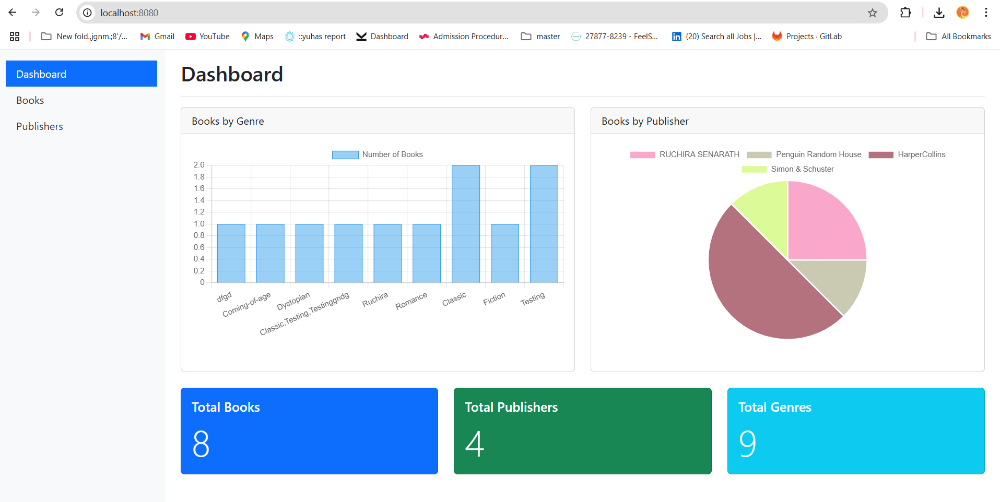
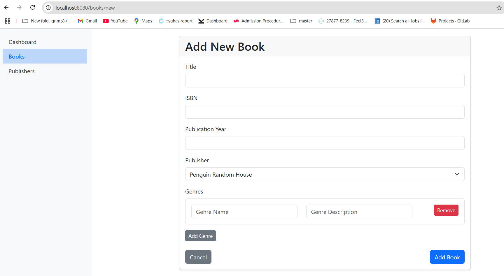
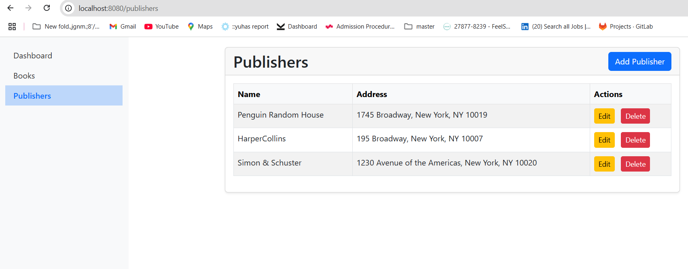

# 📚 Book Management System

A Spring Boot web application for managing books, publishers, and genres. It supports full CRUD operations and provides an interactive dashboard with charts and statistics.

## 🚀 Technologies Used

- Java 21
- Spring Boot
- Spring Data JPA
- Thymeleaf
- H2 Database (in-memory)
- Maven

## ✨ Features

### 📘 Books
- Fields:
    - `id` (Long)
    - `title` (String)
    - `isbn` (String)
    - `publicationYear` (Integer)

### 🏢 Publishers
- Fields:
    - `id` (Long)
    - `name` (String)
    - `address` (String)
    - `contactInfo` (String)

### 🎭 Genres (as value objects)
- Embedded in the `Book` entity.
- Fields:
    - `name` (String)
    - `description` (String)

### 📊 Dashboard
- Books by Genre (chart)
- Books by Publisher (chart)
- Total counts of Books, Publishers, and Genres

### 🧩 Additional
- UI built with **Thymeleaf templates**
- Embedded **H2 database** for development/testing

## 📸 Screenshots

### 🔍 Dashboard View

### 📚 Book Management


### 🏢 Publisher Management


## 📁 Project Structure

```
BookManagementSystem/
├── src/
│   ├── main/
│   │   ├── java/
│   │   │   └── com/
│   │   │       └── learnjavawithkaushi/
│   │   │           └── BookManagementSystem/
│   │   │               ├── controllers/
│   │   │               │   ├── BookController.java
│   │   │               │   ├── DashboardController.java
│   │   │               │   ├── PublisherController.java
│   │   │               ├── models/
│   │   │               │   ├── Book.java
│   │   │               │   ├── Publisher.java
│   │   │               │   └── Genre.java
│   │   │               ├── repositories/
│   │   │               │   ├── BookRepository.java
│   │   │               │   ├── PublisherRepository.java
│   │   │               ├── services/
│   │   │               │   ├── BookService.java
│   │   │               │   ├── PublisherService.java
│   │   │               └── BookManagementApplication.java
│   │   ├── resources/
│   │   │   ├── static/
│   │   │   │   └── css/
│   │   │   │       └── style.css
│   │   │   ├── templates/
│   │   │   │   ├── books/
│   │   │   │   ├── fragments/
│   │   │   │   ├── publishers/
│   │   │   │   ├── dashboard.html
│   │   │   │   └── layout.html
│   │   │   ├── application.properties
│   │   │   └── data.sql
└── pom.xml
```

## ✅ Prerequisites

- Java 21
- Maven 3.6+
- IDE (e.g., IntelliJ IDEA, Eclipse, VS Code)

## ▶️ Running the Application

1. **Clone the Repository**
   ```bash
   git clone https://git01lab.cs.univie.ac.at/vu-advanced-software-engineering/students/2025s/ASE_12413702.git
   cd ASE_12413702
   ```

2. **Build the Project**
   ```bash
   mvn clean install
   ```

3. **Run the Application**
   ```bash
   mvn spring-boot:run
   ```

4. **Access the App**
   Open your browser and go to:  
   👉 [http://localhost:8080](http://localhost:8080)

## 🗃️ H2 Database Console

Access the embedded H2 console for development and debugging:

- URL: 👉 [http://localhost:8080/h2-console](http://localhost:8080/h2-console)
- JDBC URL: `jdbc:h2:mem:bookdb`
- User: `sa`
- Password: *(leave blank)*

## 🧪 Testing

Unit tests have been implemented for the service layer using **JUnit 5** and **Mockito**. These tests verify core business logic and ensure that the services interact correctly with the repository layer.

### ✅ Technologies Used for Testing
- JUnit 5
- Mockito
- Spring Boot Test
- MockMvc (optional for controller testing)

### 📁 Test Coverage
The following service classes have been tested:

- `BookServiceTest`
- `PublisherServiceTest`

### 🧪 Tested Functionalities
- `save()` – Verifies saving a new entity works correctly.
- `findById()` – Checks retrieval of an entity by ID.
- `findAll()` – Ensures the service returns all entities.
- `deleteById()` – Confirms deletion works as expected.
- `count()` – (for `PublisherService`) Confirms count is returned correctly.

### ▶️ Running Tests
To run tests, use your IDE or run via Maven:
```bash
mvn test
```

## 📝 Notes

- The H2 database is **in-memory** and resets on every application restart.
- Genres are managed as embedded value objects inside the `Book` entity.
- Dashboard charts are rendered using **Chart.js** via Thymeleaf templates.

## 🚧 Future Improvements

- Add user authentication and role-based access control.
- Expose a REST API for frontend or third-party integration.
- Implement search and pagination for books and publishers.
- Migrate to a persistent database (e.g., MySQL or PostgreSQL) for production use.

## 👩‍💻 Author

**Name**: Hithandura Gedara Kaushali Shanika De Silva  
**Student ID**: 12413702
